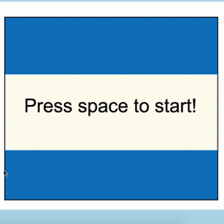

# Connect 4

[Live Version]( https://jiangtt18.github.io/connect-four/)

# Description

Connect Four is a two-player connection game in which the players first choose a color and then take turns dropping one colored disc from the top into a seven-column, six-row vertically suspended grid. The pieces fall straight down, occupying the next available space within the column.

# Technologies
### Javascript
This game was primarily made with basic Javascript.  

### HTML5/CSS3
All stylings used CSS3 with HTML5. Simplicity and minimalism style were
applied to fit the game environment with limited time offered.

### Webpack
Game files were separated into Board, ComputerPlayer and Game. Each file handled its own logic to keep the code reusable and manageable. Webpack was used to bundle up different files and export all in the program.

### Canvas
The board and disc were drew by canvas.

# Future Direction
* Develop algorithm to detect winning move for the computer player
* Create different levels for users
* Build backend to track of different winners on the leaderboard
